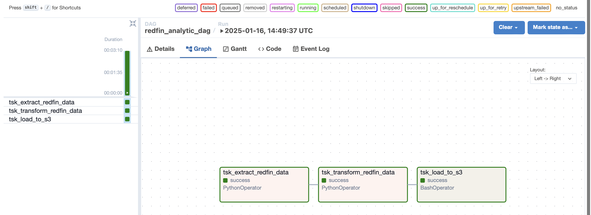
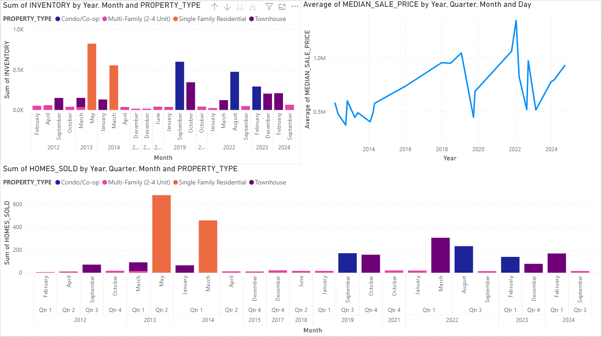

# 🏠 Real Estate Analysis Project

## 📝 Overview

This project is a comprehensive real estate data analysis pipeline designed to extract, transform, and load (ETL) real estate data from Redfin, perform analytics, and visualize insights. The pipeline is built using modern data engineering and analytics tools, including **Python**, **AWS EC2**, **S3 Bucket**, **Snowflake**, **Power BI**, and **Apache Airflow**. The goal is to provide actionable insights into real estate market trends, such as median sale prices, inventory levels, and property types across different regions.

---

## 🛠️ Tools and Technologies Used

1. **🐍 Python**: Used for data extraction, transformation, and loading (ETL) processes. Libraries like `pandas`, `boto3`, and `sqlalchemy` are utilized for data manipulation, AWS interactions, and database operations.
2. **☁️ AWS EC2**: Hosts the Apache Airflow server for orchestrating the ETL pipeline.
3. **📦 AWS S3 Bucket**: Stores raw and transformed data files during the ETL process.
4. **❄️ Snowflake**: A cloud-based data warehouse used for storing and querying processed data.
5. **📊 Power BI**: Used for creating interactive dashboards and visualizations to analyze real estate trends.
6. **🌀 Apache Airflow**: Orchestrates the entire ETL workflow, ensuring tasks are executed in the correct order and dependencies are managed.

---

## 🔄 Project Workflow

### 1. **📥 Data Extraction**
   - **Source**: Data is extracted from Redfin's public dataset hosted on AWS S3.
   - **Tool**: Python script using `pandas` to read the `.tsv.gz` file.
   - **Process**:
     - The dataset is downloaded from a Redfin Website
     - The data is saved as a CSV file locally on the EC2 instance.

### 2. **🔄 Data Transformation**
   - **Tool**: Python script using `pandas` for data cleaning and transformation.
   - **Process**:
     - Remove unnecessary columns and handle missing values.
     - Convert date columns (`period_begin`, `period_end`) to datetime format.
     - Extract year and month from date columns for time-based analysis.
     - Map month numbers to month names for better readability.
     - Save the transformed data as a CSV file.

### 3. **📤 Data Loading**
   - **Tool**: Python script using `boto3` to upload the transformed data to an S3 bucket.
   - **Process**:
     - The transformed CSV file is uploaded to the `redfin-transform-data-yml` S3 bucket.
     - The file is then loaded into Snowflake for further analysis.

### 4. **💾 Data Storage and Querying**
   - **Tool**: Snowflake is used as the data warehouse.
   - **Process**:
     - The transformed data is loaded into Snowflake tables.
     - SQL queries are used to analyze trends, such as median sale prices, inventory levels, and property types.

### 5. **📊 Data Visualization**
   - **Tool**: Power BI is used for creating interactive dashboards.
   - **Process**:
     - Connect Power BI to Snowflake to fetch the processed data.
     - Create visualizations such as:
       - Median sale price trends over time.
       - Inventory levels by region.
       - Property type distribution.
       - Monthly and yearly market trends.

### 6. **🎛️ Orchestration**
   - **Tool**: Apache Airflow is used to orchestrate the entire ETL pipeline.
   - **Process**:
     - Define a DAG (`redfin_analytic`) to schedule and manage tasks.
     - Tasks include:
       - Extracting data from Redfin.
       - Transforming the data.
       - Loading the data to S3 and Snowflake.
     - The DAG is scheduled to run monthly.

## 🔑 Key Features

- **🤖 Automated ETL Pipeline**: The entire process is automated using Apache Airflow, ensuring data is processed and updated regularly.
- **📈 Scalable Data Storage**: Snowflake provides a scalable and efficient solution for storing and querying large datasets.
- **📊 Interactive Dashboards**: Power BI dashboards provide real-time insights into real estate market trends.
- **☁️ Cloud-Based Infrastructure**: AWS EC2 and S3 ensure the pipeline is hosted on a reliable and scalable cloud platform.

---

## 📊 Insights from Power BI Charts

### 1. **📦 Sum of INVENTORY by Year, Month, and PROPERTY_TYPE**
   - **📈 Trends in Inventory Levels**: The chart shows fluctuations in inventory levels across different property types (Condo/Co-op, Multi-Family, Single Family Residential, Townhouse) over the years.
   - **📅 Seasonal Patterns**: There are noticeable seasonal patterns, with inventory levels peaking during certain months and dipping in others. This could indicate higher market activity during specific times of the year.
   - **🏠 Property Type Comparison**: Single Family Residential properties consistently show higher inventory levels compared to other property types, suggesting a higher availability or turnover rate for this category.

### 2. **💰 Average of MEDIAN_SALE_PRICE by Year, Quarter, Month, and Day**
   - **📈 Price Trends**: The median sale prices have shown an overall increasing trend over the years, with some fluctuations. This indicates a general appreciation in property values.
   - **📅 Quarterly and Monthly Variations**: There are variations in median sale prices across different quarters and months, which could be influenced by market demand, economic conditions, or seasonal factors.
   - **🏠 Property Type Impact**: Different property types exhibit varying median sale prices, with Single Family Residential properties generally commanding higher prices compared to Condo/Co-op and Townhouse properties.

### 3. **🏡 Sum of HOMES_SOLD by Year, Quarter, Month, and PROPERTY_TYPE**
   - **📈 Sales Volume**: The number of homes sold has varied significantly over the years, with noticeable peaks and troughs. This could be influenced by economic conditions, interest rates, and market demand.
   - **📅 Seasonal Sales**: Similar to inventory levels, there are seasonal patterns in home sales, with higher sales volumes during certain months.
   - **🏠 Property Type Performance**: Single Family Residential properties dominate the sales volume, indicating higher demand or availability compared to other property types. Condo/Co-op and Townhouse properties show relatively lower but consistent sales volumes.

---

## 🎯 Overall Conclusion

The real estate market exhibits clear seasonal trends and varying performance across different property types. Single Family Residential properties consistently show higher inventory levels and sales volumes, indicating their dominance in the market. Median sale prices have generally increased over time, reflecting market appreciation. These insights can help stakeholders make informed decisions regarding property investments, pricing strategies, and market timing.
